# Disaster Recovery Plan

> AI Invoice Automation System — 장애 복구 대책
>
> 최종 수정: 2026-03-20 (v2 — Celery Beat 통합) | 담당: 시스템 관리자

---

## 목차

1. [개요](#1-개요) (빠른 참조 TL;DR 포함)
2. [전체 아키텍처](#2-전체-아키텍처)
3. [데이터 보호 (Phase A)](#3-데이터-보호-phase-a)
4. [모니터링 (Phase B)](#4-모니터링-phase-b)
5. [복구 절차 (Phase C)](#5-복구-절차-phase-c)
6. [운영 안정화 (Phase D)](#6-운영-안정화-phase-d)
7. [스케줄 총정리](#7-스케줄-총정리)
8. [초기 설정 가이드](#8-초기-설정-가이드)
9. [장애 시나리오별 대응](#9-장애-시나리오별-대응)
10. [변경 이력](#10-변경-이력)

---

## 1. 개요

### 목적

Windows 10 데스크탑에서 Docker Compose로 운영하는 인보이스 시스템의 **데이터 보호**, **장애 감지/알림**, **복구 자동화**를 구현하여 서비스 중단과 데이터 손실을 최소화한다.

### 범위

| 구분 | 포함 항목 |
|------|-----------|
| 데이터 보호 | PostgreSQL 백업, Redis 영속성, 미디어/설정 백업, 로그 로테이션 |
| 모니터링 | 헬스체크 API, Docker healthcheck, 텔레그램 알림, 디스크 감시 |
| 복구 자동화 | DB 복원, 미디어 복원, 전체 시스템 원클릭 복원 |
| 운영 안정화 | 리소스 제한, Graceful Shutdown, Celery Beat 스케줄링, Celery 장애 알림 |

### 파일 구조

```
backend/app/tasks/
└── backup_tasks.py             # Celery 백업/모니터링 태스크 (6개)

scripts/
├── backup/                     # 셸 스크립트 (수동 실행 참고용, 자동 실행은 Celery)
│   ├── backup-db.sh
│   ├── backup-media.sh
│   ├── backup-config.sh
│   ├── backup-all.sh
│   └── rotate-backups.sh
├── monitoring/
│   ├── alert.sh                # 텔레그램 알림 발송 (수동 테스트용)
│   ├── health-check.sh
│   └── disk-monitor.sh
└── restore/                    # 복원은 수동 실행 (그대로 유지)
    ├── restore-db.sh
    ├── restore-media.sh
    └── restore-all.sh

docker/
└── redis.conf                  # Redis RDB 영속성 설정
```

### 빠른 참조 (TL;DR)

**시작**: `docker compose up -d --build` — 이것만 하면 백업/모니터링 전부 자동.

**작동 흐름:**

```
docker compose up -d
       │
       ▼
  celery_beat (스케줄러) ──시간표대로──▶ Redis (메시지 큐)
                                           │
                                           ▼
                                     celery_worker (실행)
                                           │
                        ┌──────────────────┼──────────────────┐
                        ▼                  ▼                  ▼
                   pg_dump → DB백업    tarfile → 미디어백업   SELECT 1 → 헬스체크
                        │                  │                  │
                        ▼                  ▼                  ▼
              /backups/ (컨테이너)  →  호스트 디스크에 저장  +  이상 시 텔레그램 알림
```

**무엇을 백업하나:**

| 대상 | 주기 | 방식 | 보관 |
|------|------|------|------|
| PostgreSQL DB | 매일 03:00 KST | `pg_dump` + 무결성 검증 | 일간 7, 주간 4, 월간 3 |
| 미디어 파일 (인보이스 PDF/이미지) | 매일 03:30 KST | `tar.gz` 압축 | 7개 |
| 환경설정 (.env, credentials) | 매주 일 04:00 KST | `tar.gz` 압축 | 5개 |

**호스트 저장 구조:**

```
C:/Users/philk/Documents/invoice-backups/   ← 컨테이너 밖, 안전
├── db/
│   ├── daily/    ← 최근 7개 (1주)
│   ├── weekly/   ← 최근 4개 (1달)
│   └── monthly/  ← 최근 3개 (3달)
├── media/        ← 최근 7개 (1주)
└── config/       ← 최근 5개 (5주)
```

**모니터링:**

| 항목 | 주기 | 이상 시 |
|------|------|---------|
| DB + Redis 연결 | 5분마다 | 텔레그램 CRITICAL |
| 디스크 사용률 | 1시간마다 | 85% WARNING, 95% CRITICAL |
| Celery 태스크 실패 | 즉시 | 텔레그램 + Sentry |

**복구 (수동):**

```bash
bash scripts/restore/restore-db.sh <백업파일>       # DB만 복원
bash scripts/restore/restore-media.sh <백업파일>     # 미디어만 복원
bash scripts/restore/restore-all.sh                  # 전체 복원 (원클릭)
```

---

## 2. 전체 아키텍처

### 시스템 구성도

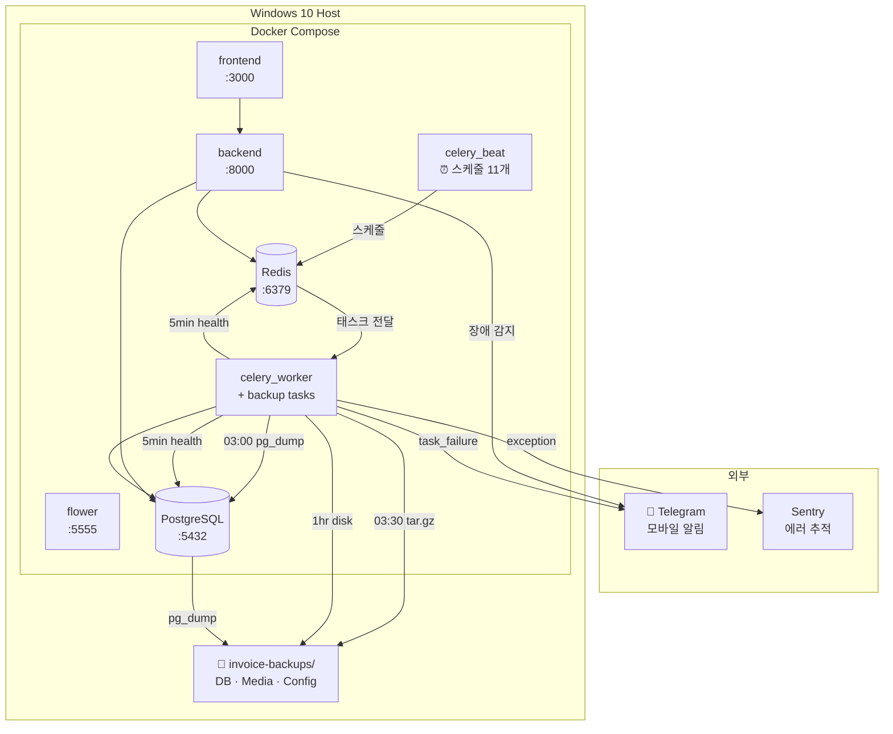

### 데이터 흐름 — 백업 & 복원

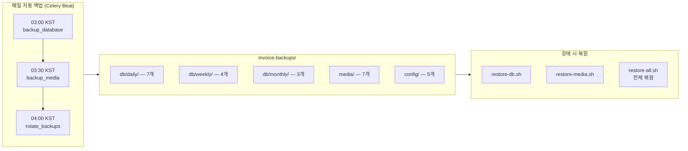

---

## 3. 데이터 보호 (Phase A)

### 3-1. PostgreSQL 자동 백업

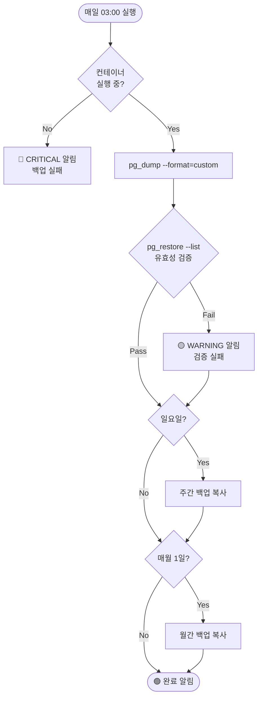

| 항목 | 설정 |
|------|------|
| Celery 태스크 | `app.tasks.backup_tasks.backup_database` |
| 실행 주기 | 매일 03:00 KST (Celery Beat, UTC 18:00) |
| 백업 방식 | `pg_dump --format=custom` (압축, 선택적 복원 가능) |
| 검증 | `pg_restore --list`로 백업 파일 무결성 확인 |
| 저장 위치 | `/backups/db/` (호스트: `BACKUP_DIR_HOST` 환경변수) |

**보관 정책:**

| 주기 | 보관 개수 | 최대 기간 |
|------|----------|-----------|
| 일간 | 7개 | ~1주 |
| 주간 (일요일) | 4개 | ~1개월 |
| 월간 (1일) | 3개 | ~3개월 |

### 3-2. Redis 영속성

| 항목 | 이전 (위험) | 이후 (안전) |
|------|:---:|:---:|
| 저장 방식 | 메모리만 | RDB 스냅샷 + 디스크 |
| Docker volume | 없음 | `redis_data:/data` |
| 컨테이너 재시작 | **데이터 전체 소실** | 자동 복구 |

**RDB 스냅샷 규칙** (`docker/redis.conf`):

| 조건 | 의미 |
|------|------|
| `save 900 1` | 15분 내 1건 이상 변경 시 저장 |
| `save 300 10` | 5분 내 10건 이상 변경 시 저장 |
| `save 60 10000` | 1분 내 10,000건 이상 변경 시 저장 |

### 3-3. 로그 로테이션

모든 Docker 서비스에 적용:

```yaml
logging:
  driver: json-file
  options:
    max-size: "10m"    # 파일당 최대 10MB
    max-file: "5"      # 최대 5개 파일 유지
```

| 서비스 (7개) | 서비스당 최대 | 전체 최대 |
|-------------|:---:|:---:|
| db, redis, backend, celery_worker, celery_beat, flower, frontend | 50MB | **~350MB** |

### 3-4. 백업 로테이션

| 항목 | 설정 |
|------|------|
| Celery 태스크 | `app.tasks.backup_tasks.rotate_backups` |
| 실행 주기 | 매일 04:00 KST (Celery Beat, UTC 19:00) |
| 동작 | 보관 기한 초과 파일을 오래된 순서대로 삭제 |

---

## 4. 모니터링 (Phase B)

### 4-1. Health API

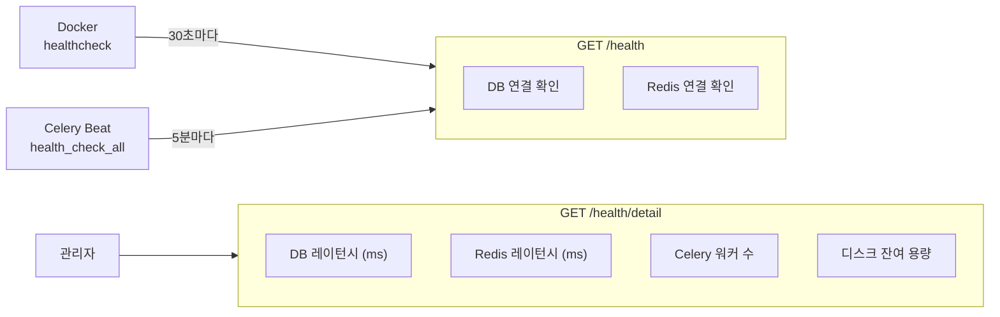

**`GET /health`** — Docker healthcheck용 (인증 불필요)

```json
{
  "status": "healthy | degraded | unhealthy",
  "environment": "development",
  "checks": {
    "database": "connected",
    "redis": "connected"
  }
}
```

**`GET /health/detail`** — 관리자 상세 진단

```json
{
  "status": "healthy",
  "checks": {
    "database": { "status": "connected", "latency_ms": 2.1 },
    "redis":    { "status": "connected", "latency_ms": 0.8 },
    "celery":   { "status": "active",    "workers": 1 },
    "disk":     { "status": "ok",        "free_gb": 45.2, "usage_percent": 72.3 }
  }
}
```

### 4-2. Docker Healthcheck

| 서비스 | 방식 | 주기 | 시작 유예 |
|--------|------|:---:|:---:|
| db | `pg_isready` | 10초 | — |
| redis | `redis-cli ping` | 10초 | — |
| backend | `urllib → /health` | 30초 | 30초 |
| celery_worker | `celery inspect ping` | 60초 | 30초 |
| celery_beat | schedule 파일 수정시간 확인 (<5분) | 60초 | 30초 |

### 4-3. 텔레그램 알림

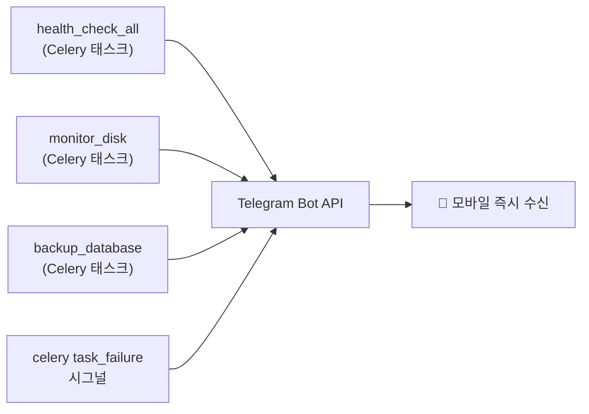

| 레벨 | 아이콘 | 의미 | 예시 |
|------|:---:|------|------|
| CRITICAL | 🔴 | 즉시 대응 필요 | DB 다운, 백업 실패, 컨테이너 비정상 |
| WARNING | 🟡 | 주의 관찰 | 디스크 85%, 백업 검증 실패 |
| INFO | 🟢 | 정상 보고 | 백업 완료, 복원 완료 |

**알림 설정:**

```bash
# .env.dev에 추가
TELEGRAM_BOT_TOKEN=your-bot-token    # BotFather에서 발급
TELEGRAM_CHAT_ID=your-chat-id        # @userinfobot으로 확인
```

### 4-4. 헬스체크 (`health_check_all` Celery 태스크)

5분마다 Celery Beat에 의해 자동 실행:

| 점검 | 방법 |
|------|------|
| DB 연결 | `SELECT 1` (SQLAlchemy sync engine) |
| Redis 연결 | `redis.ping()` |

비정상 감지 시 → `send_telegram()` → 텔레그램 CRITICAL 알림

### 4-5. 디스크 모니터링 (`monitor_disk` Celery 태스크)

| 사용률 | 레벨 | 동작 |
|:---:|------|------|
| < 85% | 정상 | 로그만 기록 |
| 85~94% | 🟡 WARNING | 텔레그램 경고 |
| ≥ 95% | 🔴 CRITICAL | 텔레그램 긴급 알림 |

---

## 5. 복구 절차 (Phase C)

### 5-1. DB 복원

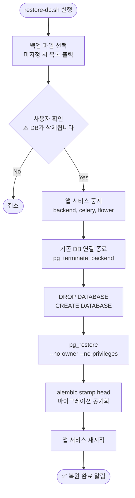

```bash
# 사용법
bash scripts/restore/restore-db.sh                              # 백업 목록 표시
bash scripts/restore/restore-db.sh /path/to/invoice_db.dump     # 지정 파일로 복원
```

### 5-2. 미디어 복원

```bash
bash scripts/restore/restore-media.sh                           # 백업 목록 표시
bash scripts/restore/restore-media.sh /path/to/media.tar.gz     # 지정 파일로 복원
```

### 5-3. 전체 시스템 복원 (원클릭)

**시스템이 완전히 망가졌을 때** 사용하는 전체 복구 스크립트:

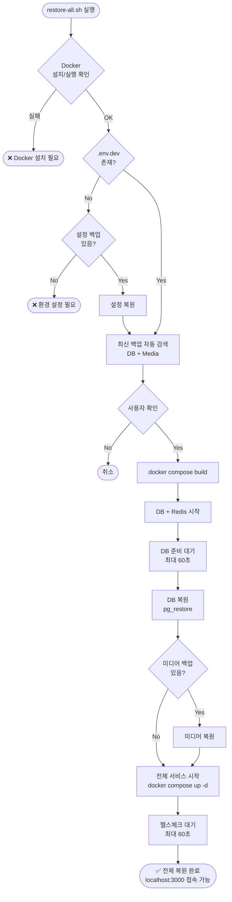

```bash
# 자동 검색 (최신 백업 사용)
bash scripts/restore/restore-all.sh

# 수동 지정
bash scripts/restore/restore-all.sh /path/to/db.dump /path/to/media.tar.gz
```

### 5-4. 환경설정 백업 (`backup-config.sh`)

수집 대상:

| 파일/디렉토리 | 내용 |
|---------------|------|
| `.env*` | 환경변수 (DB 비밀번호, API 키 등) |
| `docker-compose.yml` | 서비스 구성 |
| `docker/redis.conf` | Redis 설정 |
| `backend/credentials/` | Google 서비스 계정 키 등 |

```bash
# 암호화 백업 (AES-256)
CONFIG_BACKUP_PASSWORD=my-secret bash scripts/backup/backup-config.sh

# 복호화
openssl enc -aes-256-cbc -d -pbkdf2 \
  -in config_20260320.tar.gz.enc \
  -out config_20260320.tar.gz
```

---

## 6. 운영 안정화 (Phase D)

### 6-1. 컨테이너 리소스 제한

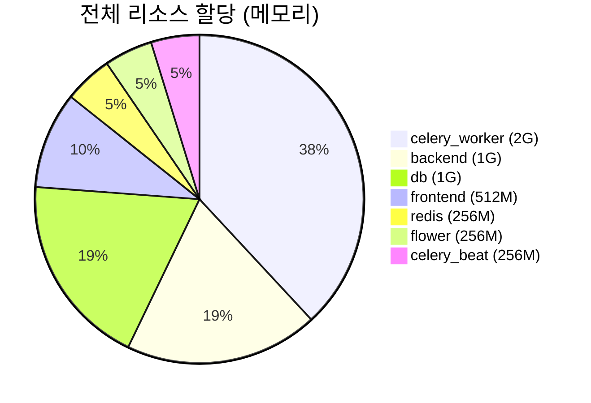

| 서비스 | CPU | 메모리 | 비고 |
|--------|:---:|:---:|------|
| backend | 2 | 1GB | API 서버 |
| celery_worker | 2 | 2GB | OCR 처리 (메모리 집약) |
| db | 1 | 1GB | PostgreSQL |
| frontend | 1 | 512MB | Next.js |
| redis | 0.5 | 256MB | 캐시/큐 |
| flower | 0.5 | 256MB | 모니터링 UI |
| celery_beat | 0.5 | 256MB | 스케줄러 |
| **합계** | **7.5** | **4.25GB** | |

### 6-2. Graceful Shutdown

| 서비스 | 종료 대기 | 이유 |
|--------|:---:|------|
| backend | 30초 | 진행 중인 HTTP 요청 완료 대기 |
| celery_worker | **120초** | OCR 등 장시간 작업 완료 대기 |
| celery_beat | 10초 | 스케줄러 (빠른 종료 가능) |

### 6-3. Celery 작업 실패 알림

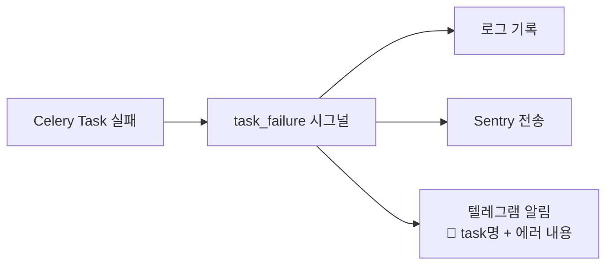

---

## 7. 스케줄 총정리

### 시간대별 일과표

```mermaid
gantt
    title 일일 자동화 스케줄
    dateFormat HH:mm
    axisFormat %H:%M

    section 백업
    DB 백업           :b1, 03:00, 15min
    미디어 백업       :b2, 03:30, 15min
    백업 로테이션     :b3, 04:00, 5min

    section 모니터링
    헬스체크 (5분 주기)    :m1, 00:00, 24h
    디스크 감시 (1시간 주기) :m2, 00:00, 24h
```

### Celery Beat 등록 태스크

| Beat 이름 | Celery 태스크 | 스케줄 (KST) | UTC |
|-----------|--------------|-------------|-----|
| backup-database | `backup_tasks.backup_database` | 매일 03:00 | 18:00 |
| backup-media | `backup_tasks.backup_media` | 매일 03:30 | 18:30 |
| rotate-backups | `backup_tasks.rotate_backups` | 매일 04:00 | 19:00 |
| health-check | `backup_tasks.health_check_all` | 5분마다 | */5 |
| disk-monitor | `backup_tasks.monitor_disk` | 매시 정각 | :00 |
| backup-config | `backup_tasks.backup_config` | 매주 일 04:00 | 일 19:00 |

> 기존 Windows Task Scheduler는 제거됨. `docker compose up -d` 한 번이면 모든 스케줄이 자동 실행.

---

## 8. 초기 설정 가이드

### Step 1. 텔레그램 봇 설정

1. Telegram에서 [@BotFather](https://t.me/BotFather)에게 `/newbot` 명령
2. 봇 토큰 발급 (예: `123456789:ABCdefGhIjKlMnOpQrStUvWxYz`)
3. 생성된 봇에게 아무 메시지 전송
4. [@userinfobot](https://t.me/userinfobot)에게 메시지 보내서 Chat ID 확인
5. `.env.dev`에 설정:

```bash
TELEGRAM_BOT_TOKEN=123456789:ABCdefGhIjKlMnOpQrStUvWxYz
TELEGRAM_CHAT_ID=987654321
```

### Step 2. 서비스 시작 (백업/모니터링 포함)

```bash
docker compose up -d --build
```

> Celery Beat가 자동으로 백업/모니터링 스케줄을 실행합니다. 별도의 스케줄러 등록 불필요.

### Step 3. 동작 확인

```bash
# 헬스체크 API
curl http://localhost:8000/health/detail

# Flower에서 Beat 스케줄 확인
# http://localhost:5555 접속

# 수동 백업 트리거 (테스트)
docker compose exec celery_worker celery -A app.tasks.celery_app call app.tasks.backup_tasks.backup_database

# 백업 파일 확인
ls -la ~/Documents/invoice-backups/db/daily/

# 복원 테스트 (개발 환경에서만!)
bash scripts/restore/restore-db.sh /path/to/backup.dump
```

---

## 9. 장애 시나리오별 대응

### 시나리오 판단 흐름도

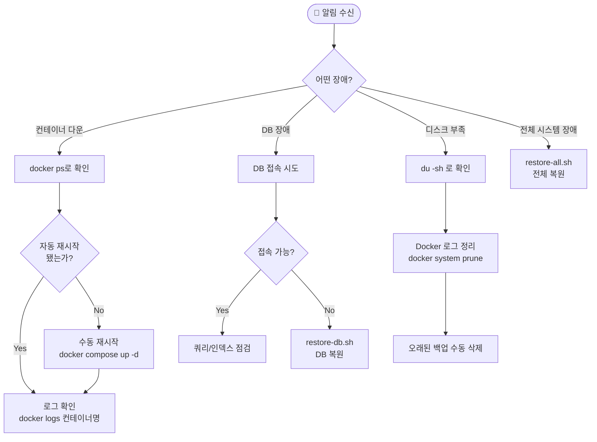

### 시나리오별 상세 대응

#### A. 단일 컨테이너 장애

| 단계 | 명령어 |
|------|--------|
| 1. 상태 확인 | `docker ps -a` |
| 2. 로그 확인 | `docker logs --tail 100 invoice_backend` |
| 3. 재시작 | `docker compose restart backend` |
| 4. 전체 재시작 | `docker compose down && docker compose up -d` |

> `restart: unless-stopped` 설정으로 대부분 자동 복구됩니다.

#### B. DB 데이터 손상/손실

| 단계 | 명령어 |
|------|--------|
| 1. 서비스 확인 | `docker exec invoice_db pg_isready` |
| 2. 백업 목록 확인 | `ls -la ~/Documents/invoice-backups/db/daily/` |
| 3. 복원 실행 | `bash scripts/restore/restore-db.sh <백업파일>` |

**예상 복구 시간**: ~5분 (데이터 크기에 따라 변동)
**최대 데이터 손실**: 24시간분 (일간 백업 기준)

#### C. 디스크 공간 부족

```bash
# 1. 상황 파악
df -h
du -sh ~/Documents/invoice-backups/*

# 2. Docker 정리
docker system prune -f
docker volume prune -f

# 3. 로그 정리 (필요 시)
docker compose down
docker compose up -d   # 로그 로테이션이 자동 적용됨
```

#### D. 전체 시스템 복구 (OS 재설치 후)

| 단계 | 설명 |
|------|------|
| 1 | Docker Desktop 설치 |
| 2 | Git으로 프로젝트 클론 |
| 3 | 설정 백업 복원 또는 `.env.dev` 수동 생성 |
| 4 | `bash scripts/restore/restore-all.sh` 실행 |

> `docker compose up -d`만 하면 백업/모니터링이 Celery Beat로 자동 실행됩니다. 별도 스케줄러 등록 불필요.

**예상 복구 시간**: ~20분

---

## 10. 변경 이력

| 날짜 | 내용 | 담당 |
|------|------|------|
| 2026-03-20 | v2 — 백업/모니터링을 Celery Beat로 통합, Windows Task Scheduler 제거 | - |
| 2026-03-20 | v1 — 초기 작성 — Phase A~D 전체 구현 | - |
