# AI Invoice Automation System — Project Design Document
**Version 12.0 | March 2026**

---

## 1. Project Overview

| Item | Details |
|------|---------|
| Project Name | AI Invoice Automation System |
| Purpose | Automate invoice intake, OCR parsing, data storage, compliance validation, approval workflow, payment tracking, and dashboard reporting |
| Target Region | United States |
| Default Language | English |
| Default Currency | USD |
| Multi-Company | Supported (Row-level isolation via company_id) |

---

## 2. Technology Stack

| Layer | Technology |
|-------|-----------|
| Backend | Python 3.11 + FastAPI |
| Frontend | Next.js 14 + Tailwind CSS |
| Database | PostgreSQL 15 |
| OCR / AI | Claude API (Anthropic) |
| PDF Parsing | pdfplumber, pdf2image |
| ORM | SQLAlchemy + Alembic |
| Authentication | JWT (FastAPI Security) |
| Email Integration | Gmail API + Microsoft Graph API (Outlook) |
| File Storage | AWS S3 (production) / Local (development) |
| Exchange Rate API | Open Exchange Rates API (auto) / Manual fallback |
| Notifications | Email (SMTP) + In-app |
| Charts | Recharts (Next.js) |
| Export | ReportLab (PDF) + openpyxl (Excel) |
| Encryption | cryptography library (AES-256 for sensitive fields) |
| Task Queue | Celery + Redis |
| Job Scheduler | Celery Beat (email polling, exchange rate update) |
| Error Monitoring | Sentry |
| Environment Config | python-dotenv (.env.dev / .env.staging / .env.prod) |
| Deployment | Docker + Docker Compose |

---

## 3. Multi-Company Architecture

### Data Isolation Strategy

| Table | Isolation | Description |
|-------|----------|-------------|
| **— System-wide (no isolation) —** | | |
| companies | — | Company master |
| exchange_rates | — | System-wide shared |
| **— Shared Pool (company_id nullable) —** | | |
| vendors | company_id (nullable) | NULL = shared pool |
| invoice_types | company_id (nullable) | NULL = system default |
| global_validation_rules | company_id (nullable) | NULL = system template |
| type_rule_sets | company_id (nullable) | NULL = system template |
| tax_rates | company_id (nullable) | NULL = system default |
| **— Company-isolated (company_id required) —** | | |
| users | company_id (required) | Per-company, Super Admin can move |
| invoices | company_id (required) | Fully isolated |
| invoice_line_items | — (via invoice_id) | Isolated via parent |
| invoice_approvals | company_id (required) | Fully isolated |
| invoice_payments | company_id (required) | Fully isolated |
| approval_settings | company_id (required) | Fully isolated |
| purchase_orders | company_id (required) | Fully isolated |
| purchase_order_lines | — (via po_id) | Isolated via parent |
| ocr_corrections | company_id (required) | Fully isolated |
| vendor_contracts | company_id (required) | Fully isolated |
| validation_results | company_id (required) | Fully isolated |
| audit_logs | company_id (required) | Fully isolated |
| notifications | company_id (required) | Fully isolated |
| email_configurations | company_id (required) | Fully isolated |

### User Role Hierarchy

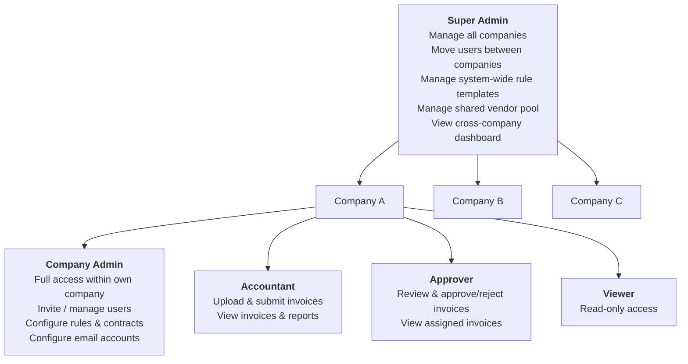

---

## 4. Invoice Input Channels

| Channel | Format | Process |
|---------|--------|---------|
| 📬 Mail (Physical) | Photo (JPG/PNG) | Manual upload → Claude OCR |
| 📧 Gmail | Body + PDF/Image (mixed) | Gmail API auto-polling → Claude OCR |
| 📧 Outlook | Body + PDF/Image (mixed) | MS Graph API auto-polling → Claude OCR |
| ✏️ Manual Entry | Web form | 사용자가 직접 입력 (OCR 없이) |

---

## 5. Invoice Types

6 default types, expandable per company from UI.

| Type Code | Type Name | Key Validation Focus |
|-----------|-----------|----------------------|
| PO | Purchase Order | PO# match, qty/price verify |
| FREIGHT | Freight / Logistics | Route, rate check |
| SERVICE | Service Contract | Contracted rate, deliverables |
| RECURRING | Recurring | Fixed amount, billing cycle |
| UTILITY | Utility | Prior month variance |
| PROFESSIONAL | Professional Service | Hourly rate, approver required |

---

## 6. Invoice Lifecycle

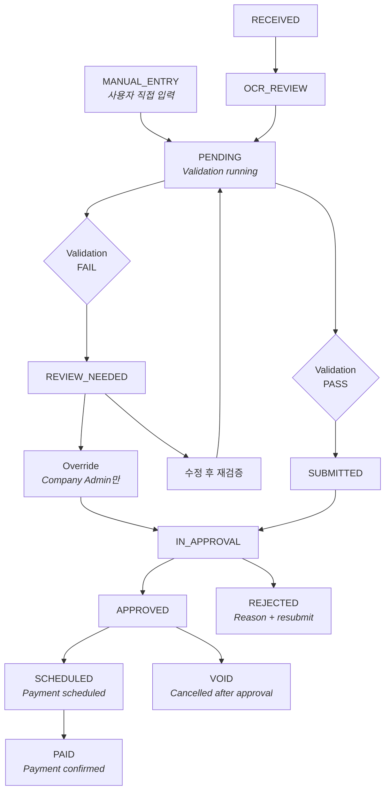

---

## 7. System Architecture

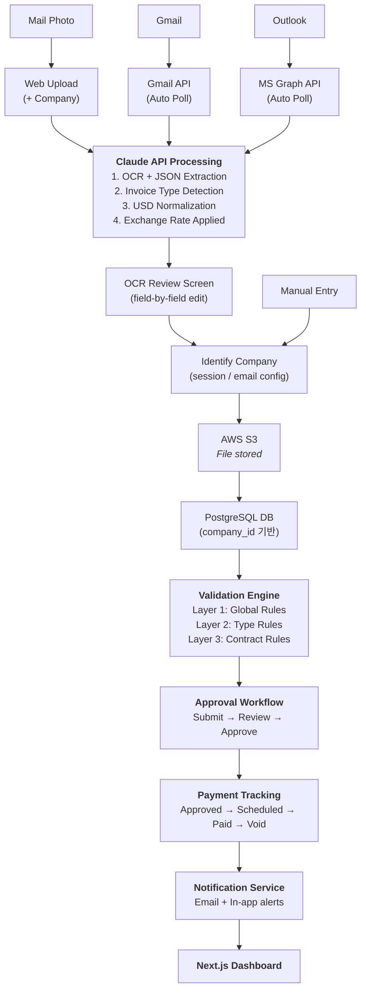

---

## 8. Database Design

### Table: companies

| Column | Type | Description |
|--------|------|-------------|
| id | UUID | Primary Key |
| company_code | VARCHAR(20) | Unique code |
| company_name | VARCHAR(255) | Legal name |
| ein | VARCHAR(20) | Company EIN |
| address | TEXT | |
| city | VARCHAR(100) | |
| state | VARCHAR(50) | |
| zip | VARCHAR(20) | |
| contact_name | VARCHAR(255) | |
| contact_email | VARCHAR(255) | |
| contact_phone | VARCHAR(50) | |
| fiscal_year_start | VARCHAR(5) | e.g. "01-01" (MM-DD). Annual Spend Limit 집계 기준 |
| default_currency | VARCHAR(10) | Default: USD |
| s3_bucket_prefix | VARCHAR(100) | Company file prefix in S3 |
| status | ENUM | ACTIVE / INACTIVE |
| created_at | TIMESTAMP | |
| updated_at | TIMESTAMP | |

---

### Table: users

| Column | Type | Description |
|--------|------|-------------|
| id | UUID | Primary Key |
| company_id | UUID | FK → companies (null = Super Admin) |
| email | VARCHAR(255) | Unique login email |
| full_name | VARCHAR(255) | |
| role | ENUM | SUPER_ADMIN / COMPANY_ADMIN / ACCOUNTANT / APPROVER / VIEWER |
| password_hash | VARCHAR | Hashed password |
| is_active | BOOLEAN | |
| last_login | TIMESTAMP | |
| notification_email | BOOLEAN | Receive email notifications |
| created_at | TIMESTAMP | |
| updated_at | TIMESTAMP | |

---

### Table: invoice_types
*company_id = NULL → system default*

| Column | Type | Description |
|--------|------|-------------|
| id | UUID | Primary Key |
| company_id | UUID | FK → companies (nullable) |
| type_code | VARCHAR(50) | |
| type_name | VARCHAR(255) | |
| description | TEXT | |
| requires_po | BOOLEAN | PO# required flag |
| requires_approver | BOOLEAN | Approver required flag |
| is_active | BOOLEAN | |
| sort_order | INTEGER | |
| created_at | TIMESTAMP | |
| updated_at | TIMESTAMP | |

---

### Table: vendors
*company_id = NULL → shared pool*
*EIN 기반 중복 감지: 동일 EIN이 공용 풀 또는 같은 company 내에 존재하면 등록 차단*

| Column | Type | Description |
|--------|------|-------------|
| id | UUID | Primary Key |
| company_id | UUID | FK → companies (nullable) |
| vendor_code | VARCHAR(20) | |
| company_name | VARCHAR(255) | |
| dba | VARCHAR(255) | |
| ein | VARCHAR(20) | Unique per company_id scope |
| ein_normalized | VARCHAR(20) | Cleaned EIN for duplicate check |
| w9_submitted | BOOLEAN | |
| w9_file_path | VARCHAR | S3 path |
| is_1099_required | BOOLEAN | |
| is_tax_exempt | BOOLEAN | Tax exempt vendor flag |
| tax_exempt_cert_path | VARCHAR | S3 path (exemption certificate) |
| tax_exempt_expiry_date | DATE | 면세 증명서 만료일 (TAX_EXEMPT_EXPIRED 알림 기준) |
| website | VARCHAR(255) | |
| vendor_category | ENUM | SERVICE / PRODUCT / BOTH |
| status | ENUM | ACTIVE / INACTIVE |
| billing_address | TEXT | |
| billing_city | VARCHAR(100) | |
| billing_state | VARCHAR(50) | |
| billing_zip | VARCHAR(20) | |
| shipping_address | TEXT | |
| shipping_city | VARCHAR(100) | |
| shipping_state | VARCHAR(50) | |
| shipping_zip | VARCHAR(20) | |
| contact_name | VARCHAR(255) | |
| contact_phone | VARCHAR(50) | |
| contact_email | VARCHAR(255) | |
| payment_terms | VARCHAR(50) | |
| bank_name | VARCHAR(255) | |
| ach_routing | VARCHAR(20) | Encrypted (AES-256) |
| ach_account | VARCHAR(100) | Encrypted (AES-256) |
| internal_buyer | VARCHAR(255) | 사내 담당 구매자 이름 (free text — 외부 연락처 포함 가능, users FK 아님) |
| approved_by | VARCHAR(255) | 벤더 등록 승인자 이름 (free text — 등록 당시 승인 기록용, users FK 아님) |
| notes | TEXT | |
| created_at | TIMESTAMP | |
| updated_at | TIMESTAMP | |

*계약 기간 관리는 vendor_contracts 테이블에서 수행. vendors 테이블의 contract_start/end는 제거 — 한 vendor에 복수 계약이 가능하므로 vendor_contracts.effective_date / expiry_date로 일원화*

---

### Table: invoices

| Column | Type | Description |
|--------|------|-------------|
| id | UUID | Primary Key |
| company_id | UUID | FK → companies (required) |
| vendor_id | UUID | FK → vendors |
| invoice_type_id | UUID | FK → invoice_types |
| invoice_number | VARCHAR(100) | |
| invoice_date | DATE | |
| due_date | DATE | |
| amount_subtotal | DECIMAL(12,2) | USD |
| amount_tax | DECIMAL(12,2) | USD |
| amount_total | DECIMAL(12,2) | USD |
| currency_original | VARCHAR(10) | Original currency |
| amount_original | DECIMAL(15,2) | Original amount |
| exchange_rate_id | UUID | FK → exchange_rates |
| po_number | VARCHAR(100) | For PO type |
| po_id | UUID | FK → purchase_orders (nullable) |
| source_channel | ENUM | UPLOAD / GMAIL / OUTLOOK / MANUAL |
| source_email | VARCHAR(255) | |
| file_path | VARCHAR | S3 path |
| raw_text | TEXT | OCR extracted |
| ocr_status | ENUM | PENDING / COMPLETED / FAILED / CORRECTED |
| status | ENUM | RECEIVED / OCR_REVIEW / PENDING / SUBMITTED / REVIEW_NEEDED / IN_APPROVAL / APPROVED / REJECTED / SCHEDULED / PAID / VOID |
| validation_status | ENUM | PENDING / PASS / FAIL / WARNING / OVERRIDDEN |
| rejection_reason | TEXT | If rejected |
| submission_round | INTEGER | 제출 횟수 (최초 생성 시 1, 재제출마다 +1) |
| notes | TEXT | |
| created_by | UUID | FK → users |
| created_at | TIMESTAMP | |
| updated_at | TIMESTAMP | |

*결제 정보는 invoice_payments.invoice_id → invoices 단방향으로만 참조. invoices 테이블에서 payment_id 역참조 없음 (순환 참조 방지)*

---

### Table: invoice_line_items
*`amount` = `quantity × unit_price` — DB에 저장하되, 변경 시 invoice_service에서 재계산 후 저장*
*company 격리: company_id 컬럼 없음. API 레이어에서 항상 `invoice_id`를 통해 접근 — 직접 line_item ID로 조회 시 반드시 invoices 테이블과 JOIN하여 company_id 검증 후 반환*

| Column | Type | Description |
|--------|------|-------------|
| id | UUID | Primary Key |
| invoice_id | UUID | FK → invoices |
| line_number | INTEGER | Line sequence |
| description | TEXT | |
| quantity | DECIMAL(10,2) | |
| unit_price | DECIMAL(12,2) | USD |
| amount | DECIMAL(12,2) | USD |
| category | VARCHAR(100) | |
| po_line_id | UUID | FK → purchase_order_lines (nullable, PO 타입만) |
| matched_contract_price | DECIMAL(12,2) | |
| price_variance_pct | DECIMAL(5,2) | |
| tax_rate_id | UUID | FK → tax_rates (nullable) |
| tax_amount | DECIMAL(12,2) | Line-level tax amount |

---

### Table: invoice_approvals
*승인 워크플로우 이력*
*approver_id = NULL: 역할(role) 기반 배정 — 해당 역할 보유 유저 전원 알림, 선착순 1명 처리*
*approver_id = UUID: 실제 승인/거절 액션을 취한 유저 ID (액션 시점에 업데이트)*

| Column | Type | Description |
|--------|------|-------------|
| id | UUID | Primary Key |
| company_id | UUID | FK → companies |
| invoice_id | UUID | FK → invoices |
| submission_round | INTEGER | 제출 회차 (validation_results와 동일 기준) |
| step | INTEGER | Approval step (1, 2, 3...) |
| approver_role | ENUM | APPROVER / COMPANY_ADMIN (배정 기준 역할) |
| approver_id | UUID | FK → users (null=미지정, 액션 시 업데이트) |
| status | ENUM | PENDING / APPROVED / REJECTED / CANCELLED |
| action_at | TIMESTAMP | When action was taken |
| comments | TEXT | Approver comments |
| rejection_reason | TEXT | If rejected |
| created_at | TIMESTAMP | |

---

### Table: invoice_payments
*지불 처리 추적*

| Column | Type | Description |
|--------|------|-------------|
| id | UUID | Primary Key |
| company_id | UUID | FK → companies |
| invoice_id | UUID | FK → invoices |
| payment_method | ENUM | ACH / CHECK / WIRE / CREDIT_CARD |
| payment_status | ENUM | SCHEDULED / PROCESSING / PAID / FAILED / VOID |

*payment_status 전환:*
- `SCHEDULED` → Company Admin이 결제 예약 시
- `PROCESSING` → ACH/Wire 등 처리 요청 후 은행 확인 대기 중 (비동기 확인이 필요한 결제 수단에 한해 사용)
- `PAID` → 결제 완료 확인 시
- `FAILED` → 결제 실패 시 (재시도 가능)
- `VOID` → 결제 취소 시
| scheduled_date | DATE | Planned payment date |
| paid_date | DATE | Actual payment date |
| amount_paid | DECIMAL(12,2) | USD |
| transaction_ref | VARCHAR(100) | Bank transaction ref |
| bank_name | VARCHAR(255) | |
| notes | TEXT | |
| created_by | UUID | FK → users |
| created_at | TIMESTAMP | |
| updated_at | TIMESTAMP | |

---

### Table: exchange_rates
*시스템 공용 환율 테이블*
*UNIQUE 제약: (from_currency, to_currency, rate_date) — 동일 날짜 중복 insert 방지*

| Column | Type | Description |
|--------|------|-------------|
| id | UUID | Primary Key |
| from_currency | VARCHAR(10) | e.g. KRW |
| to_currency | VARCHAR(10) | e.g. USD |
| rate | DECIMAL(15,6) | Exchange rate |
| rate_date | DATE | Rate effective date |
| source | ENUM | AUTO_API / MANUAL |
| updated_by | UUID | FK → users (null = auto) |
| created_at | TIMESTAMP | |
| updated_at | TIMESTAMP | |

---

### Table: global_validation_rules
*company_id = NULL → system template*
*rule_type별 조건값은 config JSONB에 저장하여 컬럼 낭비 방지*

| Column | Type | Description |
|--------|------|-------------|
| id | UUID | Primary Key |
| company_id | UUID | FK → companies (nullable) |
| parent_rule_id | UUID | FK → self (inherited) |
| rule_name | VARCHAR(255) | |
| rule_type | ENUM | MAX_AMOUNT / PAYMENT_TERMS / REQUIRED_DOC / DUPLICATE_CHECK / DUE_DATE / ANNUAL_LIMIT |
| severity | ENUM | FAIL / WARNING |
| config | JSONB | rule_type별 설정값 (아래 참조) |
| apply_to_category | VARCHAR(100) | null = all |
| is_active | BOOLEAN | |
| description | TEXT | |
| created_by | UUID | FK → users |
| created_at | TIMESTAMP | |
| updated_at | TIMESTAMP | |

*config JSONB 예시:*
```json
MAX_AMOUNT:      { "max_invoice_amount": 50000 }
PAYMENT_TERMS:   { "allowed_terms": ["Net30", "Net60", "Due on Receipt"] }
REQUIRED_DOC:    { "required_documents": ["W9"] }
DUPLICATE_CHECK: { "check_window_days": 30, "match_fields": ["vendor_id", "invoice_number"] }
DUE_DATE:        { "grace_days": 5 }
ANNUAL_LIMIT:    { "annual_spend_limit": 500000, "fiscal_year_based": true, "scope": "all_vendors" }
```
*DUPLICATE_CHECK match_fields 옵션:*
- `["vendor_id", "invoice_number"]` — 동일 vendor + invoice_number 조합 (기본값, 가장 엄격)
- `["vendor_id", "amount_total", "invoice_date"]` — invoice_number 없을 때 금액+날짜 조합으로 감지
- 두 조건을 OR로 적용하려면 규칙을 2개 생성하여 각각 severity 지정

*ANNUAL_LIMIT scope 옵션:*
- `"all_vendors"` — 회사 전체 인보이스 합산 (기본값)
- `"per_vendor"` — 특정 vendor별 연간 한도 (vendor_id를 추가로 지정)
- `"per_type"` — invoice_type별 연간 한도 (invoice_type_id를 추가로 지정)

---

### Table: type_rule_sets
*company_id = NULL → system template*

| Column | Type | Description |
|--------|------|-------------|
| id | UUID | Primary Key |
| company_id | UUID | FK → companies (nullable) |
| invoice_type_id | UUID | FK → invoice_types |
| parent_rule_set_id | UUID | FK → self (inherited) |
| rule_set_name | VARCHAR(255) | |
| description | TEXT | |
| is_active | BOOLEAN | |
| created_by | UUID | FK → users |
| created_at | TIMESTAMP | |
| updated_at | TIMESTAMP | |

---

### Table: type_rule_conditions

| Column | Type | Description |
|--------|------|-------------|
| id | UUID | Primary Key |
| rule_set_id | UUID | FK → type_rule_sets |
| condition_name | VARCHAR(255) | |
| condition_type | ENUM | AMOUNT_MATCH / RATE_CHECK / CYCLE_CHECK / VARIANCE_CHECK / ROUTE_CHECK / DELIVERABLE_CHECK / HOURLY_RATE_CHECK / REQUIRES_APPROVER |

*condition_type 설명:*
- `AMOUNT_MATCH` — 금액이 고정값과 일치하는지 (RECURRING: 매월 동일 금액)
- `RATE_CHECK` — 단가/요율이 기준 이내인지 (FREIGHT, SERVICE)
- `CYCLE_CHECK` — 청구 주기 준수 여부 (RECURRING: 월 1회 등)
- `VARIANCE_CHECK` — 전월 대비 변동률 (UTILITY: 전월 ±N%)
- `ROUTE_CHECK` — 운송 경로 유효성 (FREIGHT)
- `DELIVERABLE_CHECK` — 납품/서비스 완료 문서 첨부 여부 (SERVICE)
- `HOURLY_RATE_CHECK` — 시간당 요율 상한 (PROFESSIONAL)
- `REQUIRES_APPROVER` — 특정 Approver 필수 지정 여부 (PROFESSIONAL)
| severity | ENUM | FAIL / WARNING |
| operator | ENUM | EQ / NEQ / GT / LT / GTE / LTE / IN / BETWEEN / PCT_VARIANCE |
| threshold_value | VARCHAR(255) | |
| threshold_value2 | VARCHAR(255) | For BETWEEN |
| field_target | VARCHAR(100) | |
| description | TEXT | |
| is_active | BOOLEAN | |
| sort_order | INTEGER | |
| created_at | TIMESTAMP | |

---

### Table: vendor_contracts

| Column | Type | Description |
|--------|------|-------------|
| id | UUID | Primary Key |
| company_id | UUID | FK → companies |
| vendor_id | UUID | FK → vendors |
| invoice_type_id | UUID | FK → invoice_types (null = all) |
| contract_name | VARCHAR(255) | |
| contract_number | VARCHAR(100) | |
| effective_date | DATE | |
| expiry_date | DATE | |
| expiry_warning_days | INTEGER | |
| max_order_amount | DECIMAL(12,2) | |
| allowed_categories | TEXT | |
| contracted_prices | JSONB | Item → unit price |
| price_tolerance_pct | DECIMAL(5,2) | |
| notes | TEXT | |
| file_path | VARCHAR | S3 path |
| is_active | BOOLEAN | |
| created_by | UUID | FK → users |
| created_at | TIMESTAMP | |
| updated_at | TIMESTAMP | |

---

### Table: validation_results

*REJECTED 후 재제출 시 기존 결과는 삭제하지 않고 submission_round로 이력 구분*

| Column | Type | Description |
|--------|------|-------------|
| id | UUID | Primary Key |
| company_id | UUID | FK → companies |
| invoice_id | UUID | FK → invoices |
| submission_round | INTEGER | 1 = 최초, 2 = 1차 재제출, ... |
| layer | ENUM | GLOBAL / TYPE / CONTRACT |
| rule_id | UUID | layer별 원본 규칙 ID (참고용 스냅샷) |
| rule_table | VARCHAR(50) | FK 대상 테이블명: 'global_validation_rules' / 'type_rule_conditions' / 'vendor_contracts' |
| rule_name | VARCHAR(255) | Snapshot |
| condition_name | VARCHAR(255) | Snapshot |
| result | ENUM | PASS / FAIL / WARNING / OVERRIDDEN |
| reason | TEXT | |
| override_by | UUID | FK → users (null = not overridden) |
| override_reason | TEXT | Override 사유 |
| checked_at | TIMESTAMP | |

---

### Table: purchase_orders
*PO 마스터 — PO 타입 인보이스 매칭 기준*

| Column | Type | Description |
|--------|------|-------------|
| id | UUID | Primary Key |
| company_id | UUID | FK → companies (required) |
| vendor_id | UUID | FK → vendors |
| po_number | VARCHAR(100) | UNIQUE per company_id (멀티컴퍼니: 회사 내에서만 유일) |
| po_date | DATE | PO issued date |
| description | TEXT | PO description |
| amount_total | DECIMAL(12,2) | Total PO amount (USD) |
| amount_invoiced | DECIMAL(12,2) | Total invoiced so far |
| amount_remaining | DECIMAL(12,2) | Remaining balance |
| status | ENUM | OPEN / PARTIALLY_INVOICED / FULLY_INVOICED / CLOSED / CANCELLED |
| file_path | VARCHAR | S3 path (PO document) |
| notes | TEXT | |
| created_by | UUID | FK → users |
| created_at | TIMESTAMP | |
| updated_at | TIMESTAMP | |

---

### Table: purchase_order_lines
*PO 라인 아이템*
*`amount` = `quantity × unit_price` — DB에 저장하되, quantity 또는 unit_price 변경 시 po_service에서 항상 재계산 후 저장*
*company 격리: company_id 컬럼 없음. API 레이어에서 항상 `po_id`를 통해 접근 — 직접 조회 시 purchase_orders와 JOIN하여 company_id 검증 필수*

| Column | Type | Description |
|--------|------|-------------|
| id | UUID | Primary Key |
| po_id | UUID | FK → purchase_orders |
| line_number | INTEGER | |
| description | TEXT | Item description |
| quantity | DECIMAL(10,2) | Ordered quantity |
| unit_price | DECIMAL(12,2) | Agreed unit price (USD) |
| amount | DECIMAL(12,2) | Line total (USD) |
| quantity_invoiced | DECIMAL(10,2) | Qty invoiced so far |
| category | VARCHAR(100) | |

---

### Table: ocr_corrections
*OCR 수정 이력 — 원본 vs 사용자 수정값*
*`corrected_at`이 레코드 생성 시각과 동일 (INSERT 시 설정, 이후 불변). 별도 created_at 불필요.*

| Column | Type | Description |
|--------|------|-------------|
| id | UUID | Primary Key |
| company_id | UUID | FK → companies |
| invoice_id | UUID | FK → invoices |
| field_name | VARCHAR(100) | e.g. "vendor_name", "amount_total" |
| ocr_value | TEXT | Original OCR extracted value |
| corrected_value | TEXT | User corrected value |
| corrected_by | UUID | FK → users |
| corrected_at | TIMESTAMP | |

---

### Table: tax_rates
*State별 세율 관리 — company_id = NULL → 시스템 기본값*

| Column | Type | Description |
|--------|------|-------------|
| id | UUID | Primary Key |
| company_id | UUID | FK → companies (nullable) |
| tax_name | VARCHAR(100) | e.g. "CA Sales Tax" |
| tax_type | ENUM | FEDERAL / STATE_SALES / STATE_USE / EXEMPT |
| state_code | VARCHAR(5) | e.g. "CA", "NY", "TX" |
| rate_pct | DECIMAL(6,4) | Tax rate (e.g. 8.2500) |
| effective_date | DATE | Rate effective from |
| expiry_date | DATE | Rate expiry (null = current) |
| is_active | BOOLEAN | |
| notes | TEXT | |
| created_at | TIMESTAMP | |
| updated_at | TIMESTAMP | |

---

### Table: audit_logs
*모든 데이터 변경 이력 기록*
*`user_id` = NULL 허용 — Celery scheduled task 등 시스템 자동 액션 시 NULL로 기록. `entity_type`에 'system'으로 구분 가능.*

| Column | Type | Description |
|--------|------|-------------|
| id | UUID | Primary Key |
| company_id | UUID | FK → companies |
| user_id | UUID | FK → users |
| action | ENUM | CREATE / UPDATE / DELETE / APPROVE / REJECT / SUBMIT / SCHEDULE / PAY / VOID / LOGIN / EXPORT / OCR_CORRECT / PO_CREATE / PO_CLOSE / OVERRIDE |
| entity_type | VARCHAR(50) | e.g. "invoice", "vendor" |
| entity_id | UUID | Target record ID |
| old_values | JSONB | Before snapshot |
| new_values | JSONB | After snapshot |
| ip_address | VARCHAR(50) | User IP |
| user_agent | TEXT | Browser info |
| created_at | TIMESTAMP | |

---

### Table: notifications

| Column | Type | Description |
|--------|------|-------------|
| id | UUID | Primary Key |
| company_id | UUID | FK → companies |
| user_id | UUID | FK → users (target) |
| type | ENUM | APPROVAL_REQUEST / INVOICE_APPROVED / INVOICE_REJECTED / VALIDATION_FAIL / VALIDATION_OVERRIDDEN / CONTRACT_EXPIRY / PAYMENT_DUE / EMAIL_RECEIVED / OCR_REVIEW_NEEDED / OCR_FAILED / PO_OVER_BUDGET / TAX_EXEMPT_EXPIRED |
| title | VARCHAR(255) | |
| message | TEXT | |
| entity_type | VARCHAR(50) | Related entity |
| entity_id | UUID | Related record ID |
| is_read | BOOLEAN | |
| email_sent | BOOLEAN | |
| created_at | TIMESTAMP | |

---

### Table: approval_settings
*회사별 승인 단계 설정 — 금액 구간 + 단계별 승인자 역할 각각 정의*

| Column | Type | Description |
|--------|------|-------------|
| id | UUID | Primary Key |
| company_id | UUID | FK → companies |
| invoice_type_id | UUID | FK → invoice_types (null = 모든 타입) |
| amount_threshold_min | DECIMAL(12,2) | 구간 최솟값 |
| amount_threshold_max | DECIMAL(12,2) | 구간 최댓값 (null = 무제한) |
| step | INTEGER | 승인 단계 번호 (1, 2, 3...) |
| step_approver_role | ENUM | APPROVER / COMPANY_ADMIN |
| is_active | BOOLEAN | |
| created_at | TIMESTAMP | |
| updated_at | TIMESTAMP | |

*설계 원칙: 같은 (company_id, invoice_type_id, 금액 구간)에 step=1, step=2 ... 행을 각각 insert하여 다단계 승인 구성*
*금액 구간 경계: `amount_threshold_min <= amount_total < 다음 구간 min` 방식으로 해석. max는 "이 구간의 상한" 의미이며, 조회 쿼리는 `min <= amount AND (max IS NULL OR amount < max)` 또는 `max`를 포함 상한(<=)으로 사용 시 소수점 갭 없이 설정 가능. 아래 예시는 포함 상한(<=) 기준.*

*예시:*
| amount_min | amount_max | step | role |
|-----------|-----------|------|------|
| 0.00 | 5000.00 | 1 | APPROVER |
| 5000.01 | 50000.00 | 1 | APPROVER |
| 5000.01 | 50000.00 | 2 | COMPANY_ADMIN |
| 50000.01 | null | 1 | COMPANY_ADMIN |

*주의: DECIMAL 금액이므로 구간 경계를 소수점 2자리 기준으로 정의. 예를 들어 $5,000.00 인보이스는 첫 번째 구간, $5,000.01부터 두 번째 구간 적용.*

---

### Table: email_configurations

| Column | Type | Description |
|--------|------|-------------|
| id | UUID | Primary Key |
| company_id | UUID | FK → companies |
| email_provider | ENUM | GMAIL / OUTLOOK |
| email_address | VARCHAR(255) | |
| credentials | JSONB | OAuth tokens (encrypted) |
| filter_keywords | TEXT | Subject keywords |
| filter_senders | TEXT | Allowed sender domains |
| is_active | BOOLEAN | |
| last_polled_at | TIMESTAMP | |
| last_message_id | VARCHAR(255) | 마지막 처리한 메시지 ID (중복 방지) |
| processed_message_ids | TEXT | 최근 처리 message_id 목록 (JSON, 최대 500건) |
| created_at | TIMESTAMP | |

---

## 9. User Roles & Permissions

| Action | Super Admin | Company Admin | Accountant | Approver | Viewer |
|--------|:-----------:|:-------------:|:----------:|:--------:|:------:|
| Manage Companies | ✅ | ❌ | ❌ | ❌ | ❌ |
| Manage Users | ✅ | ✅ own | ❌ | ❌ | ❌ |
| Move Users between Companies | ✅ | ❌ | ❌ | ❌ | ❌ |
| Manage System Rule Templates | ✅ | ❌ | ❌ | ❌ | ❌ |
| Manage Company Rules | ✅ | ✅ | ❌ | ❌ | ❌ |
| Manage Vendors (shared pool) | ✅ | ❌ | ❌ | ❌ | ❌ |
| Manage Vendors (own company) | ✅ | ✅ | ❌ | ❌ | ❌ |
| Upload / Create Invoices | ✅ | ✅ | ✅ | ❌ | ❌ |
| Submit Invoices for Approval | ✅ | ✅ | ✅ | ❌ | ❌ |
| Approve / Reject Invoices | ✅ | ✅ | ❌ | ✅ | ❌ |
| Schedule / Record Payment | ✅ | ✅ | ❌ | ❌ | ❌ |
| Void Invoice | ✅ | ✅ | ❌ | ❌ | ❌ |
| Override Validation Fail | ✅ | ✅ | ❌ | ❌ | ❌ |
| Manage Contracts | ✅ | ✅ | ❌ | ❌ | ❌ |
| Manage Exchange Rates | ✅ | ❌ | ❌ | ❌ | ❌ |
| Manage Tax Rates | ✅ | ✅ | ❌ | ❌ | ❌ |
| Correct OCR Results | ✅ | ✅ | ✅ | ❌ | ❌ |
| Manage Purchase Orders | ✅ | ✅ | ✅ | ❌ | ❌ |
| Export Reports | ✅ | ✅ | ✅ | ❌ | ✅ |
| View Dashboard | ✅ | ✅ | ✅ | ✅ | ✅ |
| View Audit Logs | ✅ | ✅ | ❌ | ❌ | ❌ |

---

## 10. Validation Engine (3-Layer)

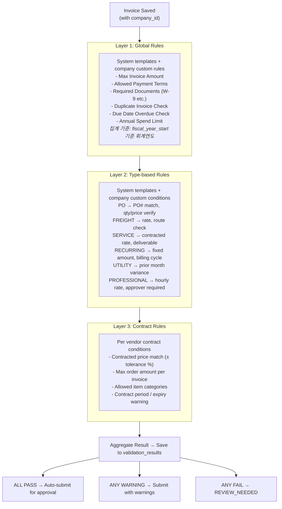

**REVIEW_NEEDED 수동 처리 흐름:**
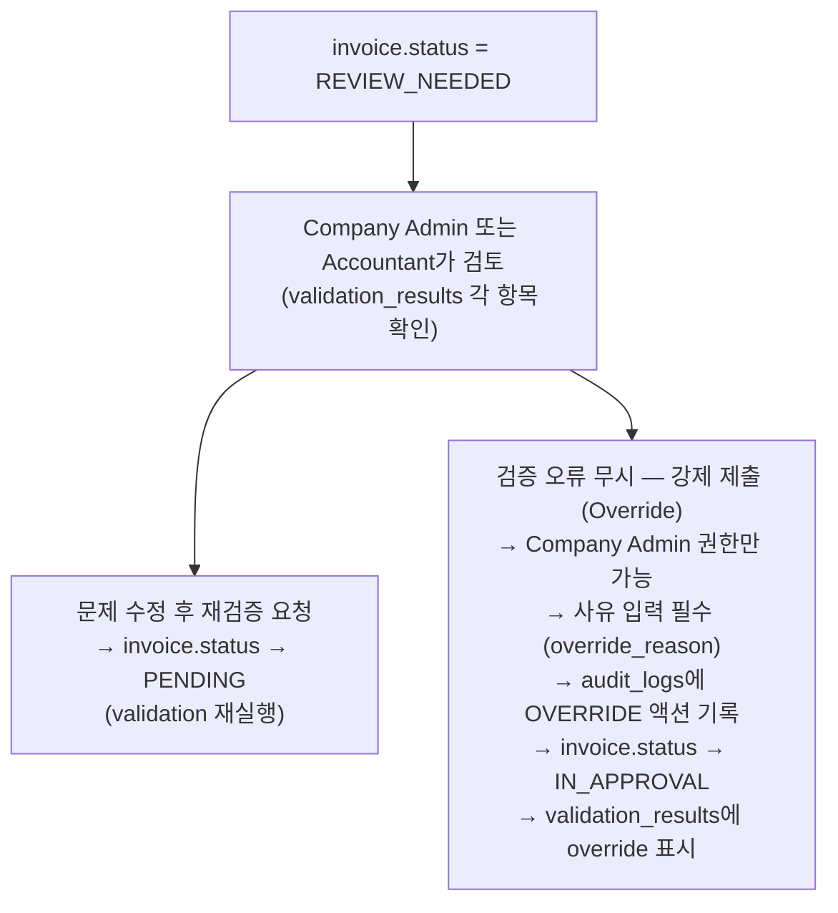

---

## 11. OCR Review & Correction Flow

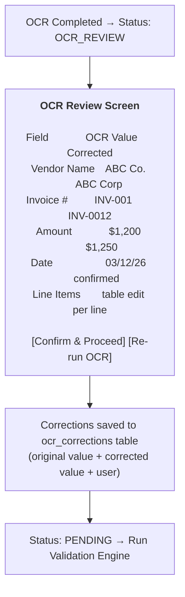

**OCR 수정 화면 규칙:**
- 모든 OCR 추출 필드를 인라인으로 수정 가능
- 수정된 필드는 시각적으로 하이라이트 표시
- Re-run OCR 버튼으로 재처리 가능
- 수정 이력은 audit_logs + ocr_corrections 양쪽에 저장

**OCR 실패 처리 흐름:**
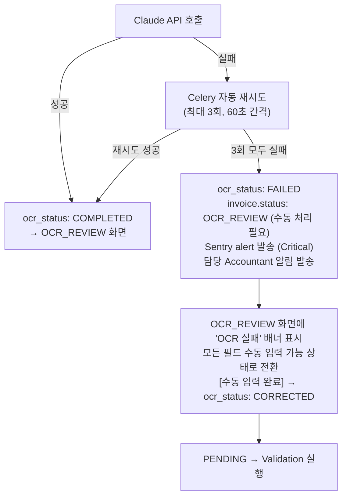

---

## 12. Purchase Order (PO) Management

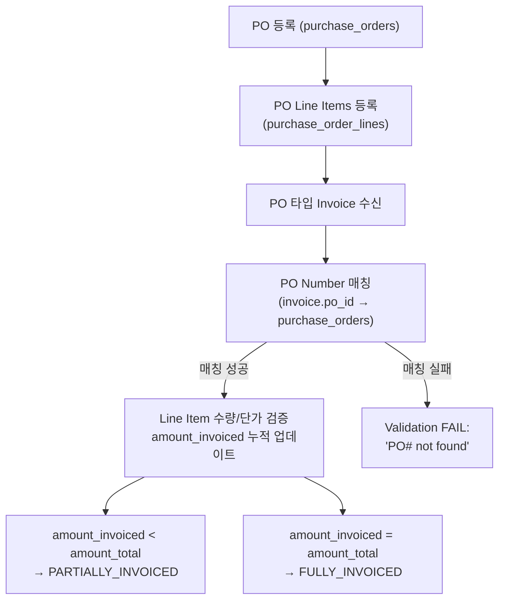

**PO 초과 청구 감지:**
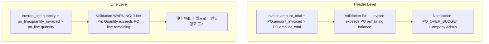

**amount_remaining 자동 업데이트 규칙:**
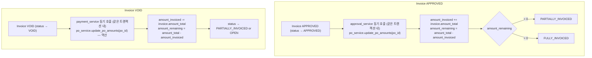
*PO 금액 업데이트는 Celery 비동기 처리 없이 approval_service / payment_service 트랜잭션 내 동기 처리. 데이터 정합성 보장을 위해 동일 DB 트랜잭션 안에서 실행.*

**동시성(Race condition) 처리:**
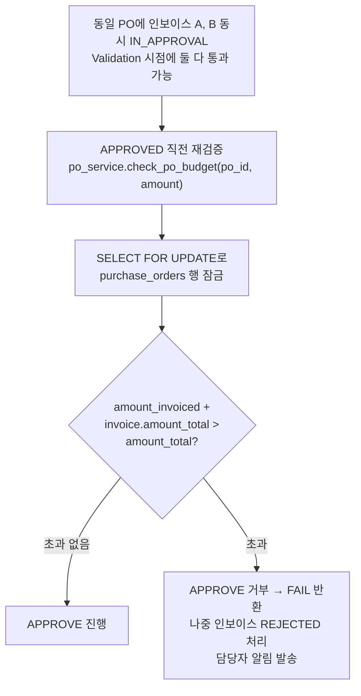

---

## 13. Tax Handling

### State Sales Tax 구조

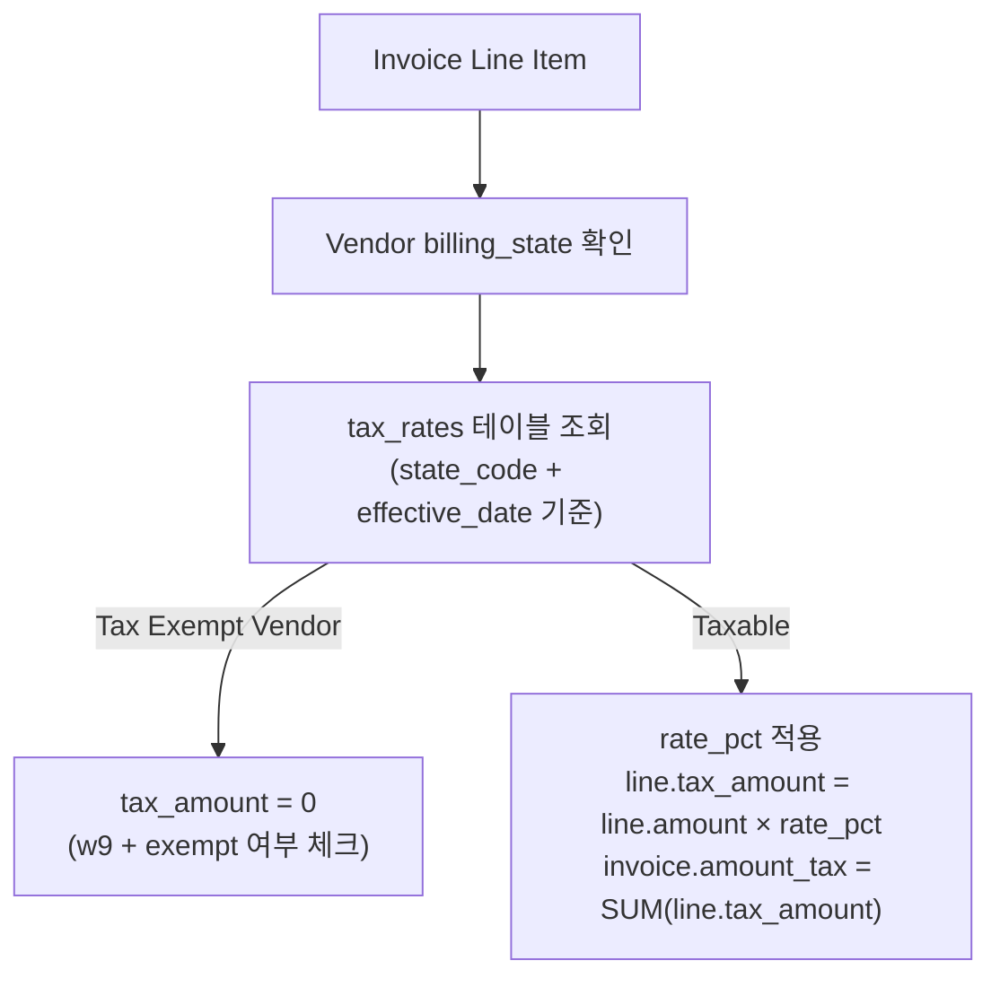

### Tax 구분

| Tax Type | Description | 처리 |
|----------|-------------|------|
| FEDERAL | Federal withholding | 1099 연동 |
| STATE_SALES | State sales tax | State별 요율 적용 |
| STATE_USE | Use tax (out-of-state) | 수동 입력 |
| EXEMPT | Tax exempt | tax_amount = 0 |

---

## 14. Background Jobs (Celery + Redis)

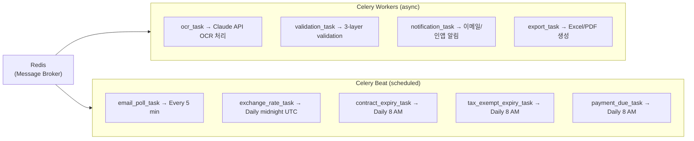

**Scheduled Task 상세 로직:**
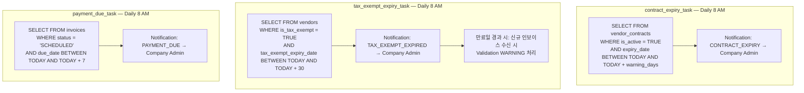

**이메일 중복 수신 방지 (Deduplication):**
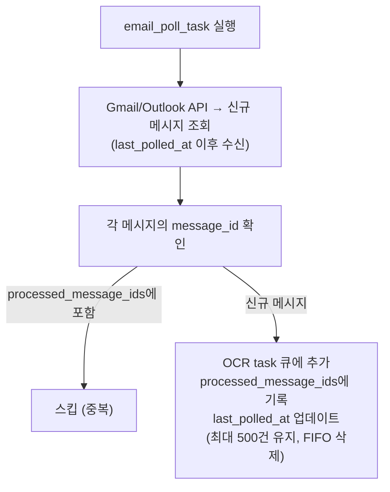

**처리 흐름:**
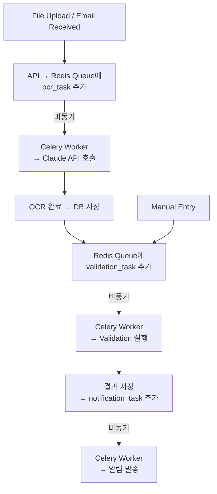

---

## 15. Error Monitoring (Sentry)

### 모니터링 대상

| 항목 | 오류 유형 | 알림 대상 | 심각도 |
|------|---------|----------|--------|
| OCR 실패 | Claude API 오류 / 파싱 실패 | Dev Team | 🔴 Critical |
| 이메일 폴링 실패 | Gmail/Outlook API 오류 | Dev Team | 🔴 Critical |
| Celery Task 실패 | 모든 비동기 작업 오류 | Dev Team | 🟠 High |
| API 5xx 오류 | FastAPI 서버 오류 | Dev Team | 🔴 Critical |
| DB 연결 오류 | PostgreSQL 연결 실패 | Dev Team | 🔴 Critical |
| S3 업로드 실패 | 파일 저장 오류 | Dev Team | 🟠 High |
| 환율 업데이트 실패 | Exchange Rate API 오류 | Dev Team | 🟡 Medium |
| JWT 인증 오류 급증 | 보안 위협 가능성 | Dev Team + Admin | 🔴 Critical |

### Sentry 설정

```
환경별 Sentry 프로젝트 분리:
  - invoice-mgmt-development  (dev)
  - invoice-mgmt-staging      (staging)
  - invoice-mgmt-production   (prod)

오류 샘플링:
  - Production: 100% 캡처
  - Staging: 100% 캡처
  - Development: 비활성화

성능 모니터링:
  - API 응답시간 추적
  - Celery Task 처리시간 추적
  - DB 쿼리 슬로우 쿼리 감지 (> 1초)
```

### 운영 알림 채널

```
Critical 오류  → Slack #alerts-critical + 이메일 즉시
High 오류      → Slack #alerts-high (일과 중 즉시)
Medium 오류    → Slack #alerts-medium (일일 요약)
```

---

## 16. Vendor Duplicate Detection

### 중복 감지 로직

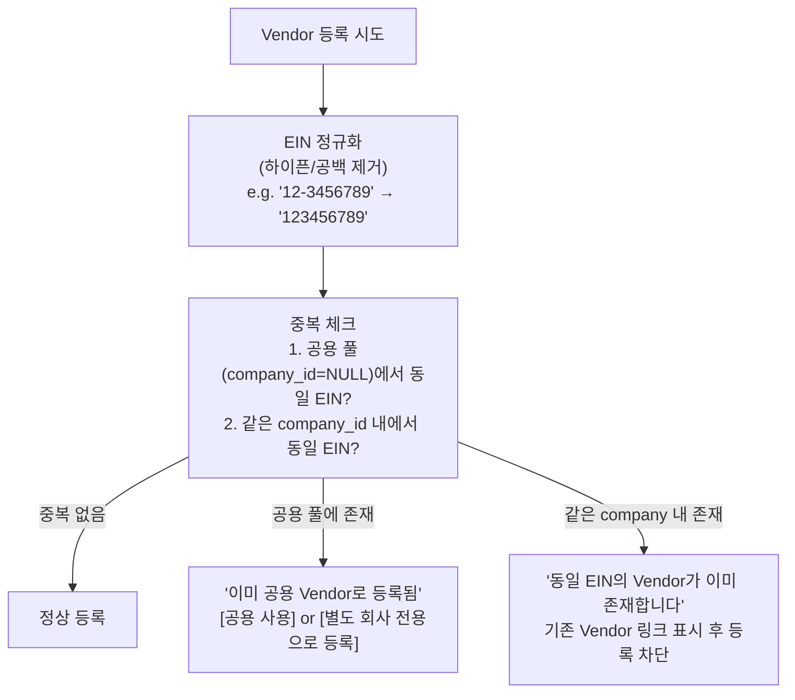

### 중복 감지 추가 기준

| 체크 항목 | 방식 | 처리 |
|---------|------|------|
| EIN 완전 일치 | 정규화 후 비교 | 등록 차단 또는 경고 |
| Company Name 유사도 | Fuzzy match (80% 이상) | WARNING 표시 후 확인 요청 |
| ACH 계좌 중복 | 동일 routing + account | WARNING 표시 |
| Email 도메인 중복 | 같은 company 내 동일 도메인 | 참고 정보 표시 |

---

## 17. Environment Configuration

```
.env.development    → 로컬 개발 (Docker local)
.env.staging        → 스테이징 서버 (테스트)
.env.production     → 운영 서버 (AWS)
```

| Variable | Dev | Staging | Prod |
|----------|-----|---------|------|
| DATABASE_URL | localhost | staging DB | RDS |
| AWS_S3_BUCKET | local mock | staging bucket | prod bucket |
| CLAUDE_API_KEY | dev key | staging key | prod key |
| REDIS_URL | localhost | staging Redis | ElastiCache |
| SENTRY_DSN | disabled | enabled | enabled |
| DEBUG | True | False | False |
| JWT_SECRET | dev-secret | staging-secret | prod-secret (rotated) |
| ALLOWED_ORIGINS | localhost:3000 | staging domain | prod domain |

---

## 18. Approval Workflow

### 승인 단계 결정 로직

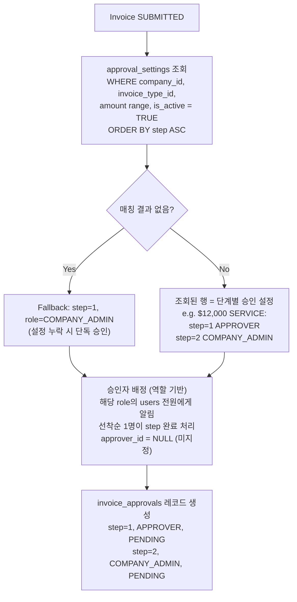

### 단계별 승인 흐름

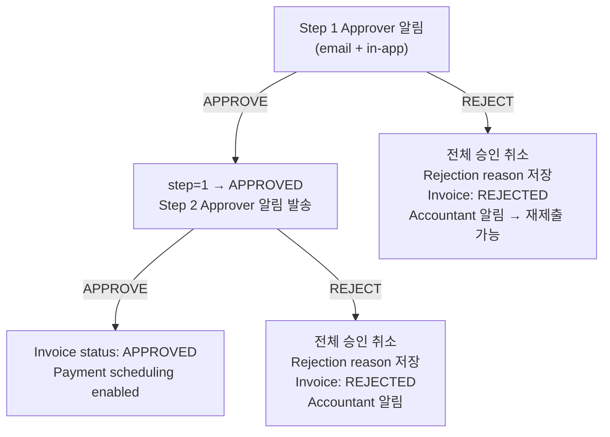

### 재제출 처리 규칙

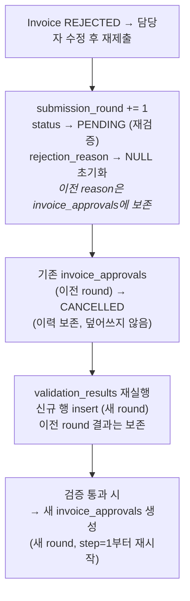

---

## 19. Payment Tracking

```mermaid
flowchart TD
    APPROVED["APPROVED"]
    APPROVED --> SCHEDULE["Company Admin schedules payment<br/>(ACH / Check / Wire / Credit Card)"]
    SCHEDULE --> CREATE["invoice_payments 생성<br/>payment_status: SCHEDULED<br/>invoices.status → SCHEDULED"]

    CREATE --> PROCESS{"Payment Method"}

    PROCESS -->|ACH / Wire| PROCESSING["payment_status: PROCESSING<br/>(은행 처리 대기)<br/>invoices.status: SCHEDULED 유지"]
    PROCESSING -->|확인 완료| PAID1["payment_status: PAID<br/>invoices.status → PAID"]
    PROCESSING -->|실패| FAILED1["payment_status: FAILED"]

    PROCESS -->|Check / Credit Card| PAID2["payment_status: PAID (즉시)<br/>paid_date + transaction_ref 기록<br/>invoices.status → PAID"]

    PROCESS -->|FAILURE| FAILED2["payment_status: FAILED<br/>notification 발송, retry 옵션"]

    VOID_TITLE["<b>VOID 처리</b>"]
    VOID_TITLE --> VOID["payment_status → VOID<br/>invoices.status → VOID<br/>po_service.update_po_amounts 역산<br/>(동일 트랜잭션 내)"]
```

---

## 20. Notification Events

| Event | Recipients | Channel |
|-------|-----------|---------|
| Invoice received (email) | Accountant | In-app |
| OCR review needed | Accountant | In-app |
| OCR failed (3회 재시도 후) | Accountant | Email + In-app |
| Validation FAIL | Accountant, Company Admin | Email + In-app |
| Approval requested | Approver | Email + In-app |
| Invoice approved | Accountant | Email + In-app |
| Invoice rejected | Accountant | Email + In-app |
| Payment due soon | Company Admin | Email + In-app |
| Payment recorded | Accountant | In-app |
| Contract expiring | Company Admin | Email + In-app |
| Annual spend limit warning | Company Admin | Email + In-app |
| PO over budget | Company Admin | Email + In-app |
| Tax exempt expired | Company Admin | Email + In-app |
| Validation overridden | Company Admin, Approver | Email + In-app |

---

## 21. File Storage Strategy (AWS S3)

```mermaid
graph LR
    S3["invoice-management-files/"]
    S3 --> COMP["{company_code}/"]
    S3 --> SHARED["shared/"]

    COMP --> INV["invoices/{year}/{month}/{invoice_id}.pdf"]
    COMP --> VEND["vendors/"]
    COMP --> CONT["contracts/{contract_id}.pdf"]
    COMP --> PO["purchase_orders/{po_id}.pdf"]

    VEND --> W9["w9/{vendor_id}_w9.pdf"]
    VEND --> TAX["tax_exempt/{vendor_id}_exempt_cert.pdf"]

    SHARED --> SVEND["vendors/"]
    SVEND --> SW9["w9/{vendor_id}_w9.pdf"]
    SVEND --> STAX["tax_exempt/{vendor_id}_exempt_cert.pdf"]
```

- Files stored in S3 with pre-signed URLs for secure access
- Local filesystem used in development (Docker volume)
- File size limit: 20MB per file
- Allowed types: PDF, JPG, JPEG, PNG

---

## 22. Exchange Rate Management

```mermaid
flowchart TD
    FETCH["Daily Auto-fetch<br/>(Open Exchange Rates API)"]
    FETCH --> UPDATE["exchange_rates table updated"]
    UPDATE --> DETECT["Invoice OCR → currency detected"]

    DETECT -->|USD| NOUSD["No conversion needed"]
    DETECT -->|Other (KRW, EUR, etc.)| LOOKUP["Lookup rate for invoice_date<br/>(fallback: latest available rate)"]
    LOOKUP --> CONVERT["amount_original × rate = USD amount<br/>exchange_rate_id saved on invoice"]
```

- Rates fetched daily at midnight UTC
- Manual override: 동일 (from_currency, to_currency, rate_date) 행이 존재하면 UPDATE, 없으면 INSERT. source=MANUAL, updated_by=현재 유저 ID로 기록
- Rate used = rate on invoice date (or nearest prior date)

---

## 23. Security

| Area | Approach |
|------|---------|
| Authentication | JWT (access token 1hr + refresh token 7d) |
| Password | bcrypt hashing |
| Sensitive fields | AES-256 encryption (ACH routing/account) |
| File access | AWS S3 pre-signed URLs (15 min expiry) |
| API security | HTTPS enforced, CORS configured |
| Rate limiting | 100 req/min per IP, 1000 req/min per company |
| SQL injection | SQLAlchemy ORM (parameterized queries) |
| Audit trail | All changes logged to audit_logs |
| Data isolation | company_id middleware on every API request |

---

## 24. Report & Export

| Report | Format | Description |
|--------|--------|-------------|
| Invoice List | Excel / PDF | Filtered by date, vendor, type, status |
| Vendor Spend Summary | Excel / PDF | Spend per vendor with YTD totals |
| Validation Report | Excel / PDF | PASS/FAIL/WARNING breakdown |
| Payment Report | Excel / PDF | Paid/scheduled/overdue |
| Audit Log Export | Excel | Change history |
| 1099 Prep Report | Excel | Vendors requiring 1099 with annual totals |

---

## 25. Dashboard KPIs

### Company Dashboard
- Total invoices this month / YTD
- Pending approval count
- Validation FAIL / WARNING count
- Total spend this month / YTD (by vendor, by type)
- Overdue payments
- Contract expiry alerts (next 30/60 days)
- Invoice trend chart (monthly)
- Spend by invoice type (pie chart)
- Top 10 vendors by spend

### Super Admin Dashboard
- Active companies count
- Total invoices across all companies
- Cross-company spend summary
- System-wide validation failure rate

---

## 26. Backup Strategy

| Item | Frequency | Retention | Method |
|------|-----------|-----------|--------|
| PostgreSQL DB | Daily | 30 days | pg_dump → S3 |
| PostgreSQL DB | Weekly | 1 year | pg_dump → S3 |
| S3 Files | Continuous | Permanent | S3 versioning |
| Audit Logs | Permanent | Permanent | Never deleted |

---

## 27. Folder Structure

### Backend (FastAPI)

```
backend/
├── app/
│   ├── main.py
│   ├── config.py
│   ├── database.py
│   │
│   ├── models/
│   │   ├── company.py
│   │   ├── user.py
│   │   ├── invoice_type.py
│   │   ├── vendor.py
│   │   ├── invoice.py
│   │   ├── invoice_line.py
│   │   ├── invoice_approval.py
│   │   ├── invoice_payment.py
│   │   ├── approval_settings.py
│   │   ├── purchase_order.py
│   │   ├── purchase_order_line.py
│   │   ├── ocr_correction.py
│   │   ├── tax_rate.py
│   │   ├── exchange_rate.py
│   │   ├── global_validation_rule.py
│   │   ├── type_rule_set.py
│   │   ├── type_rule_condition.py
│   │   ├── vendor_contract.py
│   │   ├── validation_result.py
│   │   ├── audit_log.py
│   │   ├── notification.py
│   │   └── email_configuration.py
│   │
│   ├── schemas/
│   │   ├── company.py
│   │   ├── user.py
│   │   ├── invoice_type.py
│   │   ├── vendor.py
│   │   ├── invoice.py
│   │   ├── approval.py
│   │   ├── approval_settings.py
│   │   ├── payment.py
│   │   ├── purchase_order.py
│   │   ├── ocr_correction.py
│   │   ├── tax_rate.py
│   │   ├── exchange_rate.py
│   │   ├── global_rule.py
│   │   ├── type_rule.py
│   │   ├── vendor_contract.py
│   │   ├── validation_result.py
│   │   └── notification.py
│   │
│   ├── api/v1/
│   │   ├── auth.py
│   │   ├── companies.py
│   │   ├── users.py
│   │   ├── invoice_types.py
│   │   ├── vendors.py
│   │   ├── invoices.py
│   │   ├── approvals.py
│   │   ├── approval_settings.py
│   │   ├── payments.py
│   │   ├── purchase_orders.py
│   │   ├── ocr_corrections.py
│   │   ├── tax_rates.py
│   │   ├── exchange_rates.py
│   │   ├── global_rules.py
│   │   ├── type_rules.py
│   │   ├── vendor_contracts.py
│   │   ├── validations.py
│   │   ├── reports.py
│   │   ├── audit_logs.py
│   │   └── dashboard.py
│   │
│   ├── middleware/
│   │   ├── company_context.py
│   │   ├── rate_limiter.py
│   │   └── audit_middleware.py
│   │
│   ├── services/
│   │   ├── ocr_service.py
│   │   ├── ocr_correction_service.py
│   │   ├── email_service.py
│   │   ├── validation_service.py
│   │   ├── approval_service.py
│   │   ├── approval_settings_service.py
│   │   ├── payment_service.py
│   │   ├── po_service.py
│   │   ├── tax_service.py
│   │   ├── notification_service.py
│   │   ├── exchange_rate_service.py
│   │   ├── export_service.py
│   │   ├── vendor_service.py
│   │   ├── invoice_service.py
│   │   └── audit_service.py
│   │
│   ├── tasks/                        # Celery tasks
│   │   ├── ocr_tasks.py
│   │   ├── email_tasks.py
│   │   ├── validation_tasks.py
│   │   ├── notification_tasks.py
│   │   ├── exchange_rate_tasks.py
│   │   ├── export_tasks.py
│   │   ├── scheduled_tasks.py        # contract_expiry / tax_exempt / payment_due
│   │   └── scheduler.py              # Celery Beat schedule
│   │
│   └── utils/
│       ├── pdf_parser.py
│       ├── file_handler.py
│       ├── s3_client.py
│       └── encryption.py
│
├── alembic/
├── tests/
├── requirements.txt
└── Dockerfile
```

### Frontend (Next.js)

```
frontend/
├── app/
│   ├── (auth)/
│   │   └── login/page.tsx
│   ├── (super-admin)/
│   │   ├── companies/page.tsx
│   │   ├── vendors/page.tsx             # Shared vendor pool management
│   │   ├── exchange-rates/page.tsx
│   │   └── rules/templates/page.tsx
│   ├── (company)/
│   │   ├── page.tsx                      # Dashboard
│   │   ├── vendors/
│   │   │   ├── page.tsx
│   │   │   ├── new/page.tsx
│   │   │   └── [id]/
│   │   │       ├── page.tsx
│   │   │       └── contracts/page.tsx
│   │   ├── invoices/
│   │   │   ├── page.tsx
│   │   │   ├── upload/page.tsx
│   │   │   ├── manual/page.tsx          # Manual invoice entry
│   │   │   └── [id]/
│   │   │       ├── page.tsx
│   │   │       └── ocr-review/page.tsx  # OCR correction screen
│   │   ├── purchase-orders/
│   │   │   ├── page.tsx                 # PO list
│   │   │   ├── new/page.tsx             # New PO
│   │   │   └── [id]/page.tsx            # PO detail + invoiced amounts
│   │   ├── approvals/page.tsx            # Approval queue
│   │   ├── payments/page.tsx             # Payment tracking
│   │   ├── rules/
│   │   │   ├── global/page.tsx
│   │   │   └── types/page.tsx
│   │   ├── reports/page.tsx              # Export reports
│   │   ├── audit/page.tsx                # Audit logs
│   │   └── settings/
│   │       ├── users/page.tsx
│   │       ├── email/page.tsx
│   │       ├── tax-rates/page.tsx       # Tax rate management
│   │       ├── approval-settings/page.tsx # Approval step config
│   │       └── notifications/page.tsx
│   └── layout.tsx
│
├── components/
│   ├── dashboard/
│   │   ├── SummaryCards.tsx
│   │   ├── InvoiceChart.tsx
│   │   ├── SpendByTypeChart.tsx
│   │   ├── TopVendorsTable.tsx
│   │   └── AlertsPanel.tsx
│   ├── vendors/
│   │   ├── VendorForm.tsx
│   │   └── ContractRuleForm.tsx
│   ├── invoices/
│   │   ├── DropZone.tsx
│   │   ├── InvoiceDetail.tsx
│   │   ├── InvoiceManualForm.tsx        # Manual entry form
│   │   ├── OcrReviewForm.tsx            # OCR field-by-field correction
│   │   └── ValidationResultPanel.tsx
│   ├── purchase-orders/
│   │   ├── POForm.tsx
│   │   ├── POLineItemsTable.tsx
│   │   └── POInvoiceMatchPanel.tsx
│   ├── approvals/
│   │   ├── ApprovalActionPanel.tsx
│   │   └── ApprovalSettingsForm.tsx     # Step config by amount range
│   ├── payments/
│   │   └── PaymentForm.tsx
│   ├── rules/
│   │   ├── GlobalRuleForm.tsx
│   │   ├── TypeRulePanel.tsx
│   │   └── ConditionForm.tsx
│   └── common/
│       ├── CompanySwitcher.tsx
│       ├── StatusBadge.tsx
│       ├── NotificationBell.tsx
│       └── AuditLogTable.tsx
│
└── lib/
    ├── api.ts
    ├── auth.ts
    └── utils.ts
```

---

## 28. Development Roadmap

### Phase 1 — Foundation ✅ 완료
- [x] Docker Compose 7개 서비스 구성 (PostgreSQL, Redis, Backend, Celery Worker/Beat, Flower, Frontend)
- [x] FastAPI 기본 구조 + CORS + 헬스 체크 엔드포인트 (/health)
- [x] Pydantic Settings 기반 환경변수 설정 (config.py)
- [x] SQLAlchemy 비동기 엔진 + 세션 팩토리 (database.py)
- [x] JWT 인증 모듈 (access/refresh token 생성/검증) + bcrypt 비밀번호 해싱 (security.py)
- [x] RBAC 역할 체계 정의 + require_roles 의존성 (security.py)
- [x] 멀티테넌트 ContextVar 컨텍스트 관리 (context.py)
- [x] Celery + Celery Beat 설정 및 스케줄 정의 (celery_app.py)
- [x] Sentry 에러 모니터링 초기화 (main.py)
- [x] Next.js 14 + Tailwind CSS 프로젝트 셋업
- [x] 전체 Python 패키지 의존성 정의 (requirements.txt — 48개)
- [x] .env.dev 개발 환경 설정

### Phase 2 — Company & User Management
- [ ] DB 모델 정의: companies, users 테이블 (SQLAlchemy ORM)
- [ ] Alembic 초기 마이그레이션 생성 및 적용
- [ ] company_context 미들웨어 구현 (middleware/company_context.py)
- [ ] rate_limiter 미들웨어 구현 (middleware/rate_limiter.py)
- [ ] audit 미들웨어 구현 (middleware/audit_middleware.py)
- [ ] Company CRUD API + Pydantic 스키마 (Super Admin)
- [ ] User management API + role-based access
- [ ] 인증 API (로그인/로그아웃/토큰 갱신)
- [ ] Company switcher UI
- [ ] pytest 테스트 환경 구성 (conftest.py)

### Phase 3 — Vendor Master + Duplicate Detection
- [ ] DB 모델 정의: vendors, vendor_contracts 테이블
- [ ] Alembic 마이그레이션
- [ ] Vendor API (shared pool + company-specific)
- [ ] EIN 정규화 + 중복 감지 로직
- [ ] Company name fuzzy match 경고
- [ ] ACH 계좌 중복 체크
- [ ] Vendor registration & list UI
- [ ] ACH encryption

### Phase 4 — Tax Rates & PO Master
- [ ] DB 모델 정의: tax_rates, purchase_orders, purchase_order_lines 테이블
- [ ] Alembic 마이그레이션
- [ ] Tax rate management API + UI (State별)
- [ ] PO master API + UI
- [ ] PO line items management
- [ ] PO ↔ Invoice matching logic + 초과 청구 감지

### Phase 5 — Invoice Type & Rule Engine
- [ ] DB 모델 정의: invoice_types, global_validation_rules, type_rule_sets, type_rule_conditions 테이블
- [ ] Alembic 마이그레이션
- [ ] Invoice type master
- [ ] Global rules management
- [ ] Type rule sets + conditions
- [ ] Vendor contract rules
- [ ] 3-layer validation engine (incl. PO match + tax check)

### Phase 6 — Invoice Upload, OCR, Manual Entry
- [ ] S3 file upload
- [ ] Claude API OCR → Celery async task
- [ ] OCR Review screen (field correction + ocr_corrections 저장)
- [ ] Manual invoice entry screen (OCR 없이 직접 입력)
- [ ] Exchange rate integration
- [ ] Invoice + line item save
- [ ] Auto-run validation

### Phase 7 — Approval & Payment Workflow
- [ ] Approval settings 관리 API + UI (금액 구간별 승인 단계 설정)
- [ ] Multi-step approval workflow API + UI (역할 기반 배정, 선착순 처리)
- [ ] Payment tracking API + UI
- [ ] Notification service (email + in-app) via Celery
- [ ] Scheduled tasks: contract_expiry / tax_exempt_expiry / payment_due

### Phase 8 — Email Integration
- [ ] Gmail API polling (Celery Beat)
- [ ] Outlook MS Graph API polling (Celery Beat)
- [ ] Auto vendor + type matching

### Phase 9 — Dashboard & Reports
- [ ] Per-company dashboard + KPIs
- [ ] Super Admin cross-company view
- [ ] Excel / PDF export (Celery async)
- [ ] 1099 prep report
- [ ] Audit log viewer

### Phase 10 — Polish & Deploy
- [ ] Role-based UI restrictions
- [ ] Backup strategy (pg_dump + S3)
- [ ] Docker Compose production setup
- [ ] Security audit
- [ ] Sentry alert 채널 설정 (Slack + Email)
- [ ] Testing & bug fixes
- [ ] Production deployment

---

*Document will be updated as the project progresses.*
